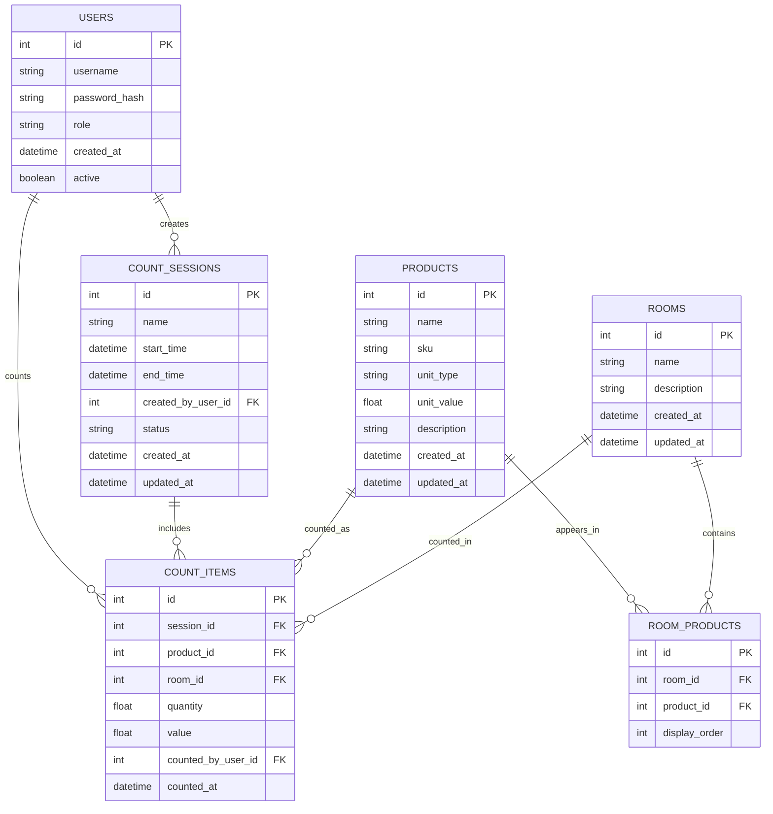

# Clover Counts Database Schema

This document provides detailed information about the database schema for the Clover Counts application.

## Entity Relationship Diagram



## Tables Description

### USERS

Stores user authentication and authorization information.

| Column | Type | Description |
|--------|------|-------------|
| id | INTEGER | Primary key, auto-increment |
| username | VARCHAR(255) | Unique username for login |
| password_hash | VARCHAR(255) | Hashed password (only used in Basic Auth mode) |
| role | VARCHAR(50) | User role: 'admin', 'manager', or 'user' |
| created_at | TIMESTAMP | When the user was created |
| active | BOOLEAN | Whether the user account is active |

### PRODUCTS

Stores information about inventory products.

| Column | Type | Description |
|--------|------|-------------|
| id | INTEGER | Primary key, auto-increment |
| name | VARCHAR(255) | Product name |
| sku | VARCHAR(100) | Stock Keeping Unit (unique identifier) |
| unit_type | VARCHAR(50) | Unit type: 'count', 'weight', 'case', etc. |
| unit_value | DECIMAL(10,2) | Monetary value per unit |
| description | TEXT | Product description |
| created_at | TIMESTAMP | When the product was created |
| updated_at | TIMESTAMP | When the product was last updated |

### ROOMS

Stores information about physical locations where inventory is kept.

| Column | Type | Description |
|--------|------|-------------|
| id | INTEGER | Primary key, auto-increment |
| name | VARCHAR(255) | Room name |
| description | TEXT | Room description |
| created_at | TIMESTAMP | When the room was created |
| updated_at | TIMESTAMP | When the room was last updated |

### ROOM_PRODUCTS

Maps products to rooms, establishing which products should be counted in which rooms.

| Column | Type | Description |
|--------|------|-------------|
| id | INTEGER | Primary key, auto-increment |
| room_id | INTEGER | Foreign key to ROOMS table |
| product_id | INTEGER | Foreign key to PRODUCTS table |
| display_order | INTEGER | Order in which products should be displayed in the room |

### COUNT_SESSIONS

Represents inventory counting sessions.

| Column | Type | Description |
|--------|------|-------------|
| id | INTEGER | Primary key, auto-increment |
| name | VARCHAR(255) | Session name |
| start_time | TIMESTAMP | When the counting session started |
| end_time | TIMESTAMP | When the counting session ended |
| created_by_user_id | INTEGER | Foreign key to USERS table (who created the session) |
| status | VARCHAR(50) | Session status: 'draft', 'in_progress', 'completed', 'finalized' |
| created_at | TIMESTAMP | When the session was created |
| updated_at | TIMESTAMP | When the session was last updated |

### COUNT_ITEMS

Stores individual counted items within a counting session.

| Column | Type | Description |
|--------|------|-------------|
| id | INTEGER | Primary key, auto-increment |
| session_id | INTEGER | Foreign key to COUNT_SESSIONS table |
| product_id | INTEGER | Foreign key to PRODUCTS table |
| room_id | INTEGER | Foreign key to ROOMS table |
| quantity | DECIMAL(10,2) | Counted quantity |
| value | DECIMAL(10,2) | Total value (quantity * unit_value) |
| counted_by_user_id | INTEGER | Foreign key to USERS table (who counted this item) |
| counted_at | TIMESTAMP | When the item was counted |

## Indexes

### Primary Keys
- USERS.id
- PRODUCTS.id
- ROOMS.id
- ROOM_PRODUCTS.id
- COUNT_SESSIONS.id
- COUNT_ITEMS.id

### Foreign Keys
- ROOM_PRODUCTS.room_id → ROOMS.id
- ROOM_PRODUCTS.product_id → PRODUCTS.id
- COUNT_SESSIONS.created_by_user_id → USERS.id
- COUNT_ITEMS.session_id → COUNT_SESSIONS.id
- COUNT_ITEMS.product_id → PRODUCTS.id
- COUNT_ITEMS.room_id → ROOMS.id
- COUNT_ITEMS.counted_by_user_id → USERS.id

### Additional Indexes
- USERS.username (unique)
- PRODUCTS.sku (unique)
- ROOM_PRODUCTS(room_id, product_id) (unique)
- COUNT_ITEMS(session_id, product_id, room_id) (unique)

## Prisma Schema

Here's how the database schema would be defined using Prisma:

```prisma
// This is your Prisma schema file,
// learn more about it in the docs: https://pris.ly/d/prisma-schema

generator client {
  provider = "prisma-client-js"
}

datasource db {
  provider = "postgresql"
  url      = env("DATABASE_URL")
}

model User {
  id                Int           @id @default(autoincrement())
  username          String        @unique
  passwordHash      String?       @map("password_hash")
  role              String        // "admin", "manager", "user"
  createdAt         DateTime      @default(now()) @map("created_at")
  active            Boolean       @default(true)
  
  // Relations
  createdSessions   CountSession[] @relation("CreatedBy")
  countedItems      CountItem[]    @relation("CountedBy")
  
  @@map("users")
}

model Product {
  id          Int           @id @default(autoincrement())
  name        String
  sku         String        @unique
  unitType    String        @map("unit_type")
  unitValue   Decimal       @map("unit_value")
  description String?
  createdAt   DateTime      @default(now()) @map("created_at")
  updatedAt   DateTime      @updatedAt @map("updated_at")
  
  // Relations
  roomProducts RoomProduct[]
  countItems   CountItem[]
  
  @@map("products")
}

model Room {
  id          Int           @id @default(autoincrement())
  name        String
  description String?
  createdAt   DateTime      @default(now()) @map("created_at")
  updatedAt   DateTime      @updatedAt @map("updated_at")
  
  // Relations
  roomProducts RoomProduct[]
  countItems   CountItem[]
  
  @@map("rooms")
}

model RoomProduct {
  id           Int      @id @default(autoincrement())
  roomId       Int      @map("room_id")
  productId    Int      @map("product_id")
  displayOrder Int      @map("display_order")
  
  // Relations
  room         Room     @relation(fields: [roomId], references: [id])
  product      Product  @relation(fields: [productId], references: [id])
  
  @@unique([roomId, productId])
  @@map("room_products")
}

model CountSession {
  id              Int       @id @default(autoincrement())
  name            String
  startTime       DateTime? @map("start_time")
  endTime         DateTime? @map("end_time")
  createdByUserId Int       @map("created_by_user_id")
  status          String    // "draft", "in_progress", "completed", "finalized"
  createdAt       DateTime  @default(now()) @map("created_at")
  updatedAt       DateTime  @updatedAt @map("updated_at")
  
  // Relations
  createdBy       User      @relation("CreatedBy", fields: [createdByUserId], references: [id])
  countItems      CountItem[]
  
  @@map("count_sessions")
}

model CountItem {
  id              Int       @id @default(autoincrement())
  sessionId       Int       @map("session_id")
  productId       Int       @map("product_id")
  roomId          Int       @map("room_id")
  quantity        Decimal
  value           Decimal
  countedByUserId Int       @map("counted_by_user_id")
  countedAt       DateTime  @map("counted_at")
  
  // Relations
  session         CountSession @relation(fields: [sessionId], references: [id])
  product         Product      @relation(fields: [productId], references: [id])
  room            Room         @relation(fields: [roomId], references: [id])
  countedBy       User         @relation("CountedBy", fields: [countedByUserId], references: [id])
  
  @@unique([sessionId, productId, roomId])
  @@map("count_items")
}
```

## Database Migrations

Initial migrations will be created using Prisma's migration system. The following command will be used to create the initial migration:

```bash
npx prisma migrate dev --name init
```

This will create the initial database schema and generate the Prisma client.

## Data Seeding

For development and testing purposes, we'll create seed data for the database. This will include:

1. Default admin user
2. Sample products
3. Sample rooms
4. Sample room-product mappings

The seed script will be defined in `prisma/seed.ts` and can be run using:

```bash
npx prisma db seed
```

## Database Backup and Restore

For production deployments, regular database backups should be configured. PostgreSQL provides several options for backups:

1. **pg_dump**: For logical backups
2. **pg_basebackup**: For physical backups
3. **WAL archiving**: For point-in-time recovery

The Docker Compose configuration includes a volume for the PostgreSQL data, which ensures data persistence across container restarts.