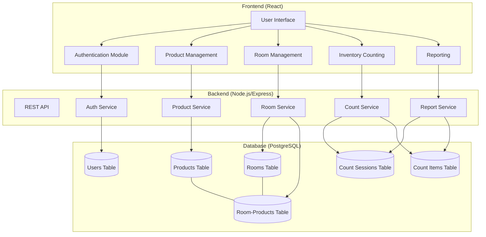
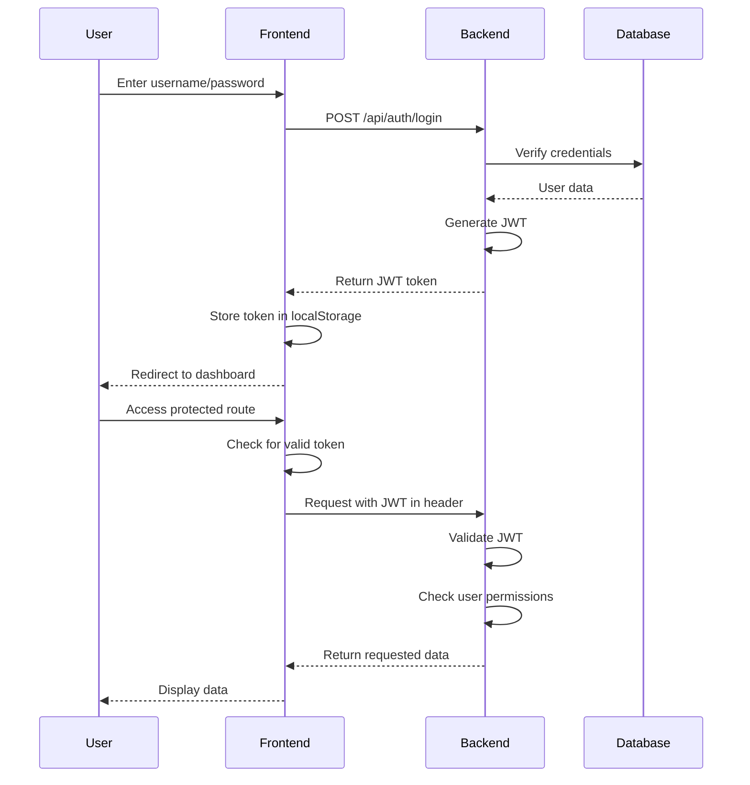
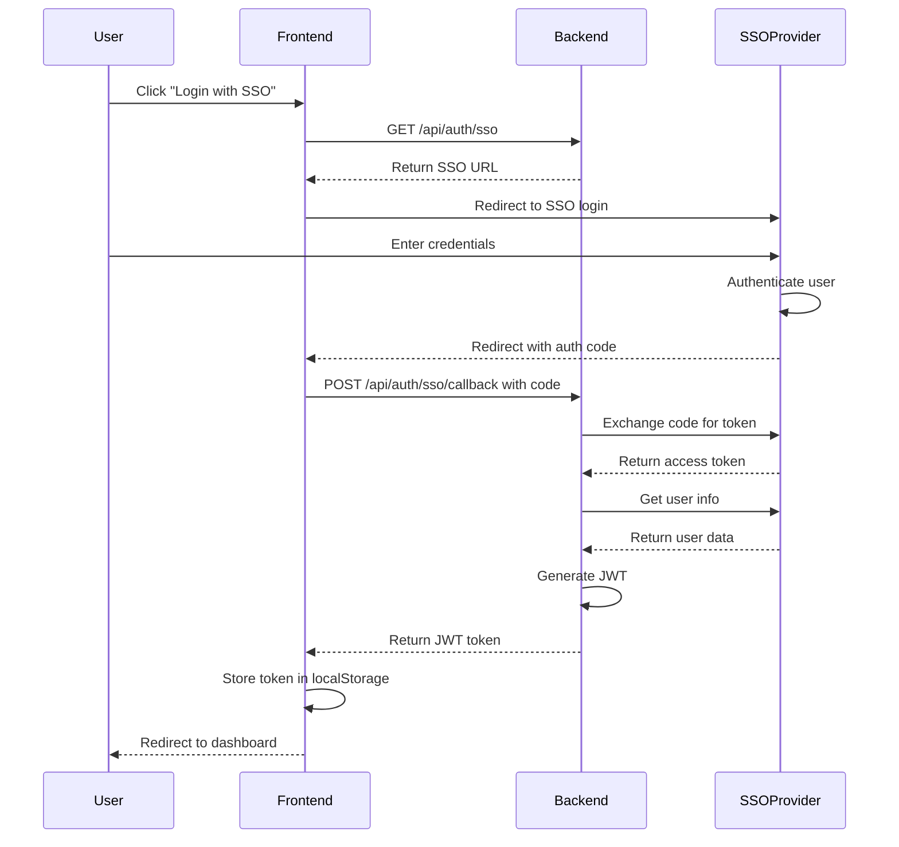
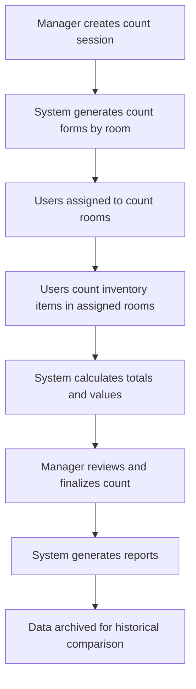

# Clover Counts Implementation Plan

## Overview

Clover Counts is a PWA for restaurant/cafeteria inventory management focused on organized product lists, room-based counts, and held-value tracking. The system is built to be web-based, responsive across devices, and cloud-native for easy deployment.

## Core Features

- **Custom Products:** Define, assign units (by count, weight, case), and set per-unit values.
- **Room-Based Lists:** Map products to physical locations, enabling accurate walk-through counts.
- **Counting Workflow:** Generate, perform, and finalize inventory sessions—support mobile/tablet entry, aggregate totals across rooms.
- **User Roles:**
  - **Admin:** Full configuration and access.
  - **Manager:** Products, layouts, session management.
  - **User:** Counting only.
- **Authentication Options:**
  - OAuth2/OpenID (SSO via CMS) — preferred, configurable.
  - Basic Auth (username/password) — fallback, with hashed storage. (Implement this first to get the project going)
- **Modern UI, Reporting, PWA:** Clean, fast, and installable app for all devices.
- **Simple deployment:** All-in-one Docker Compose stack.
- **MCL-Inspired Design:** Following the theming and color conventions of MCL Homemade.

## Recommended Technology Stack

- Utilize Your Recommended tech stack to make a light weight app with a modern and clean UI.

### Deployment
- **Docker & Docker Compose**: For containerization and easy deployment

## System Architecture



## Development Phases

### Phase 1: Project Setup and Basic Infrastructure (MVP)

1. **Project Initialization**
   - Set up project structure
   - Configure TypeScript, ESLint, Prettier
   - Set up Docker and Docker Compose
   - Initialize Git repository

2. **Database Setup**
   - Create PostgreSQL database schema
   - Set up Prisma ORM
   - Create initial migrations

3. **Backend Development**
   - Implement Express server with middleware
   - Set up basic authentication (username/password)
   - Implement JWT token generation and validation
   - Create RESTful API endpoints for core functionality
   - Implement role-based access control

4. **Frontend Development**
   - Set up React application with TypeScript
   - Implement authentication UI (login/logout)
   - Create responsive layout with Material-UI
   - Implement core feature components:
     - Product management
     - Room management
     - Inventory counting
     - Basic reporting

5. **Integration and Testing**
   - Connect frontend to backend API
   - Implement error handling
   - Manual testing of core functionality
   - Fix bugs and issues

6. **Deployment Setup**
   - Finalize Docker Compose configuration
   - Set up production build process
   - Create deployment documentation

### Phase 2: Enhanced Features and SSO Integration

1. **SSO Integration**
   - Implement OAuth2/OpenID Connect support
   - Create SSO configuration options
   - Update authentication flow to support both methods
   - Test SSO integration

2. **Advanced Reporting**
   - Implement detailed reporting features
   - Add data visualization
   - Create export functionality (CSV/PDF)

3. **PWA Features**
   - Add service worker for offline support
   - Implement app manifest
   - Add install prompts
   - Test on various devices

4. **Performance Optimization**
   - Optimize database queries
   - Implement caching strategies
   - Improve frontend performance

## UI Design and Theming

Based on the MCL Homemade website (https://www.mclhomemade.com/), we'll implement the following design elements:

### Color Palette

- **Primary Color:** Burgundy/Maroon (#8B181A) - Used for primary buttons, headers, and accents
- **Secondary Colors:**
  - White (#FFFFFF) - For text on dark backgrounds and card backgrounds
  - Light Gray (#F5F5F5) - For backgrounds and subtle separators
  - Dark Gray (#333333) - For primary text

### Typography

- **Headings:** Serif font similar to the MCL logo typography
- **Body Text:** Clean sans-serif font for readability
- **Buttons and UI Elements:** Sans-serif font

### UI Components

- **Buttons:** Burgundy background with white text, slightly rounded corners
- **Cards:** White background with subtle shadows
- **Modals:** Centered with clean white background and prominent headers
- **Forms:** Clean, minimalist design with clear labels
- **Navigation:** Simple, intuitive layout with hamburger menu on mobile

### Responsive Design

- Mobile-first approach ensuring usability on all device sizes
- Simplified navigation on smaller screens
- Touch-friendly UI elements for mobile users

### Design Mockups

Before implementation, we'll create basic wireframes for key screens:
1. Login screen (both Basic Auth and SSO options)
2. Dashboard
3. Product management
4. Room management
5. Inventory counting interface
6. Reports view

## Implementation Details

### Directory Structure

```
clover-counts/
├── frontend/
│   ├── public/
│   ├── src/
│   │   ├── assets/
│   │   ├── components/
│   │   ├── contexts/
│   │   ├── hooks/
│   │   ├── pages/
│   │   ├── services/
│   │   ├── store/
│   │   ├── types/
│   │   ├── utils/
│   │   ├── App.tsx
│   │   └── index.tsx
│   ├── package.json
│   ├── tsconfig.json
│   └── Dockerfile
├── backend/
│   ├── src/
│   │   ├── config/
│   │   ├── controllers/
│   │   ├── middleware/
│   │   ├── models/
│   │   ├── routes/
│   │   ├── services/
│   │   ├── types/
│   │   ├── utils/
│   │   └── index.ts
│   ├── prisma/
│   │   ├── schema.prisma
│   │   └── migrations/
│   ├── package.json
│   ├── tsconfig.json
│   └── Dockerfile
├── docker-compose.yml
├── .env.example
├── .gitignore
└── README.md
```

### Authentication Flow



### Future SSO Flow



### Inventory Counting Workflow



## Docker Compose Configuration

The Docker Compose setup will include three services:

1. **Frontend**: React application served by Nginx
2. **Backend**: Node.js/Express API
3. **Database**: PostgreSQL database

```yaml
version: "3.8"
services:
  frontend:
    build: ./frontend
    ports:
      - "3000:80"
    depends_on:
      - backend
    environment:
      - REACT_APP_API_URL=http://localhost:8080
      - REACT_APP_AUTH_MODE=basic

  backend:
    build: ./backend
    environment:
      - DATABASE_URL=postgresql://clover:supersecret@db:5555/cloverdb
      - JWT_SECRET=your_jwt_secret_key
      - AUTH_MODE=basic
      - PORT=8080
    ports:
      - "8080:8080"
    depends_on:
      - db

  db:
    image: postgres:14
    restart: always
    environment:
      - POSTGRES_DB=cloverdb
      - POSTGRES_USER=clover
      - POSTGRES_PASSWORD=supersecret
    volumes:
      - db_data:/var/lib/postgresql/data
    ports:
      - "5555:5432"

volumes:
  db_data:
```

## Next Steps

1. Set up the project structure and initialize the repository
2. Create the database schema and migrations
3. Implement the basic authentication system
4. Develop the core features of the application
5. Set up the Docker Compose configuration for deployment